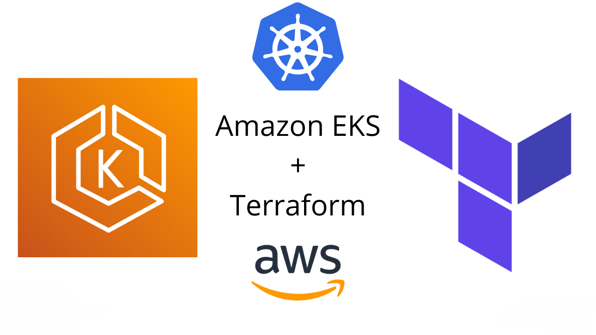

## 🚀 Projeto: Infraestrutura como Código com Terraform e Kubernetes

## 📌 Resumo do Projeto

Este projeto de Infraestrutura como Código (IaC) integra Terraform, Kubernetes e AWS ECR (Elastic Container Registry) para uma gestão de infraestrutura e aplicações mais eficiente. Utilizando o ECR para armazenamento seguro de imagens Docker e Kubernetes para orquestração de containers, o projeto se destaca pelo provisionamento de um cluster EKS (Elastic Kubernetes Service) com estratégia de grupos de nós blue/green, assegurando atualizações sem interrupções.

## ✔️ Tecnologias Utilizadas

- 🌐 **Terraform**: Ferramenta de IaC para infraestrutura segura e eficiente.
- 🐳 **Kubernetes**: Sistema open-source para orquestração de containers.
- ☁️ **AWS EKS**: Serviço gerenciado para Kubernetes na AWS.
- 📦 **AWS ECR**: Registro de containers Docker para gerenciamento de imagens.
- 🛠️ **AWS Services**: Outros serviços AWS como VPC e IAM para infraestrutura.

## 🔧 Funcionalidades do Projeto

- 📈 **Automação com Terraform**: Automatiza provisionamento e gestão de infraestrutura AWS.
- 🔄 **Orquestração com Kubernetes**: Gerencia implantação e escalonamento de aplicações.
- 🔁 **Cluster EKS com Blue/Green**: Permite atualizações sem interrupções no cluster EKS.
- 🖼️ **Gerenciamento de Imagens com ECR**: Armazena e gerencia imagens Docker no ECR.
- ⚖️ **Escalabilidade e Resiliência**: Oferece infraestrutura escalável e resiliente.

## ⚠️ Nota Importante

Antes de iniciar o projeto, é crucial atualizar o nome da imagem Docker no arquivo `k8s-deployment.tf`, localizado na pasta `infra`. Este arquivo deve referenciar o nome da imagem que você já possui no repositório da AWS. Certifique-se de que a imagem exista no AWS ECR (Elastic Container Registry) antes de proceder com a execução do Terraform.

## 🛠️ Como Iniciar o Projeto

Desenvolvido no Visual Studio Code (VSC). Para rodar:

1. 📥 **Instalação**: Instale o VSC e a extensão "HashiCorp Terraform".
2. 📋 **Preparação do Projeto**: Realize o git clone no VSC. [Repositório do Projeto](https://github.com/lucas-decastro/iac-terraform-k8s)
3. 🚀 **Inicialização do Terraform**: Execute `terraform init` em `env/prd`.
4. 🌐 **Execução**: Crie a infraestrutura com `terraform apply` em `env/prd`.

